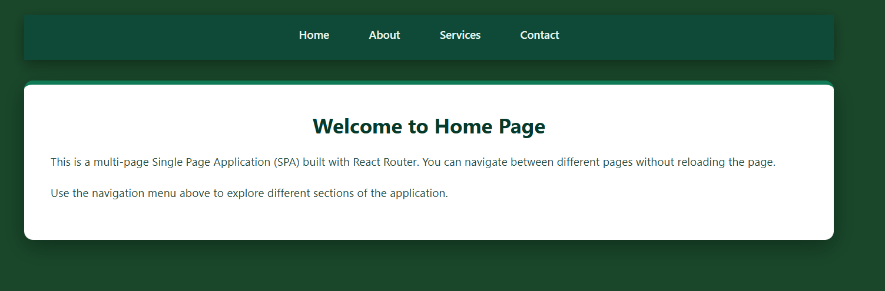
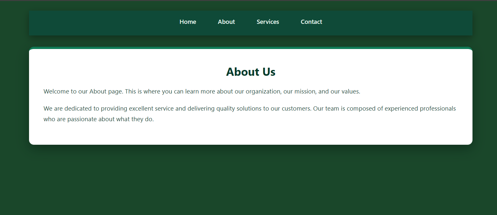
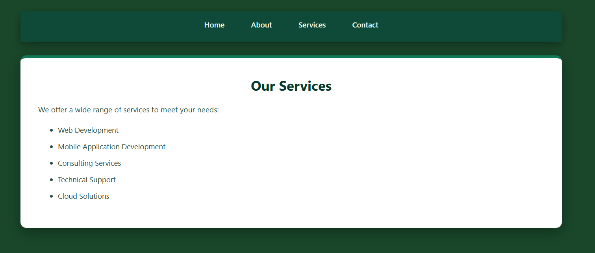
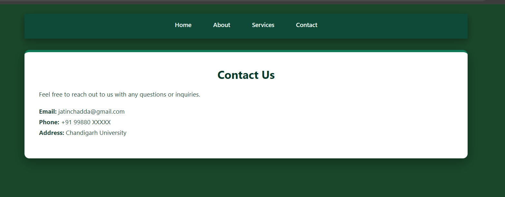

# Experiment 3 — 3.1

This folder contains the 3.1 experiment app.

## About

This experiment demonstrates a simple React app structure with component layout and styling. It focuses on static UI composition, basic routing setup, and responsive layout techniques tested for the 3.1 exercise.

## Gallery

## Run

- Install dependencies: `npm install`
- Start dev server: `npm run dev`