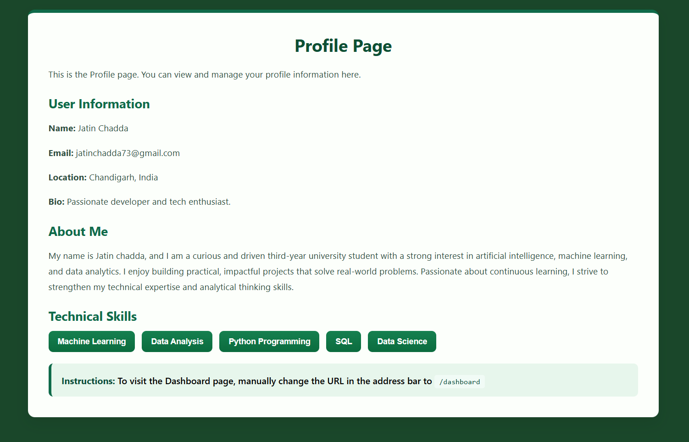
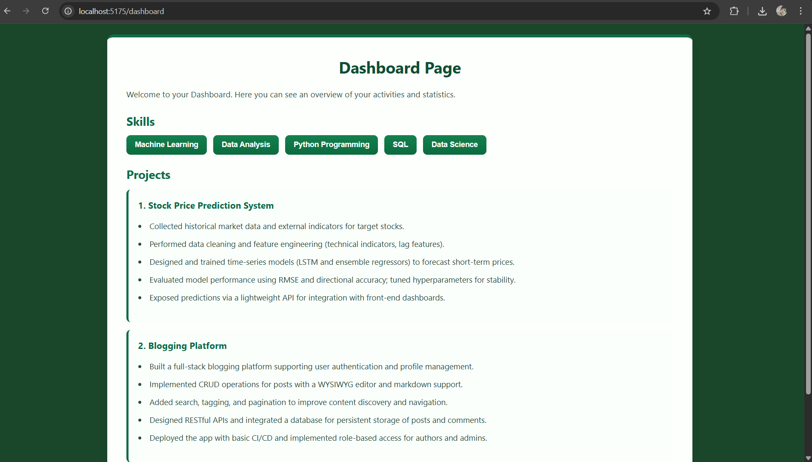

# Experiment 3 — 3.2

This folder contains the 3.2 experiment app.

## Gallery

## Run

- Install dependencies: `npm install`
- Start dev server: `npm run dev`

## About

This experiment emphasizes component communication and simple state management. It showcases passing props between components, local state usage with hooks, and small interactive UI elements for the 3.2 exercise.