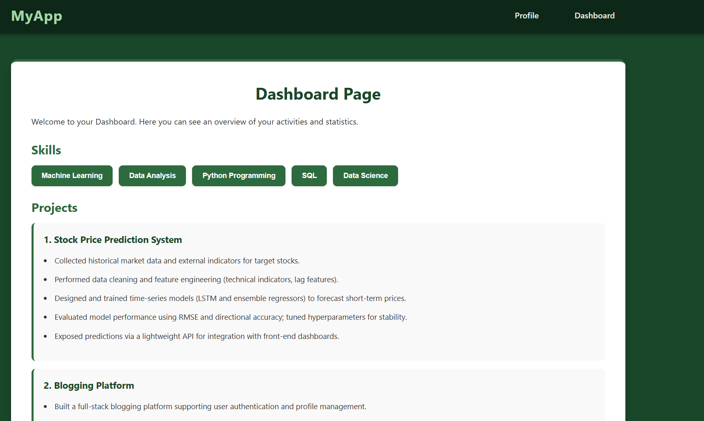
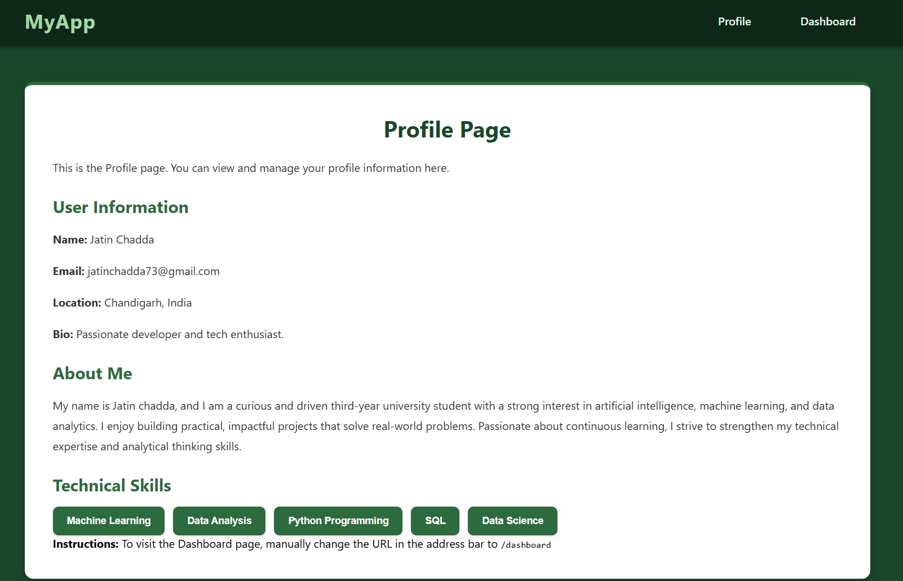

# Experiment 3 — 3.3

This folder contains the 3.3 experiment app.

## Gallery

## Run

- Install dependencies: `npm install`
- Start dev server: `npm run dev`

## About

This experiment explores component composition and interactivity. It includes examples of reusable components, event handling, and light state-driven behavior to demonstrate patterns used in the 3.3 exercise.