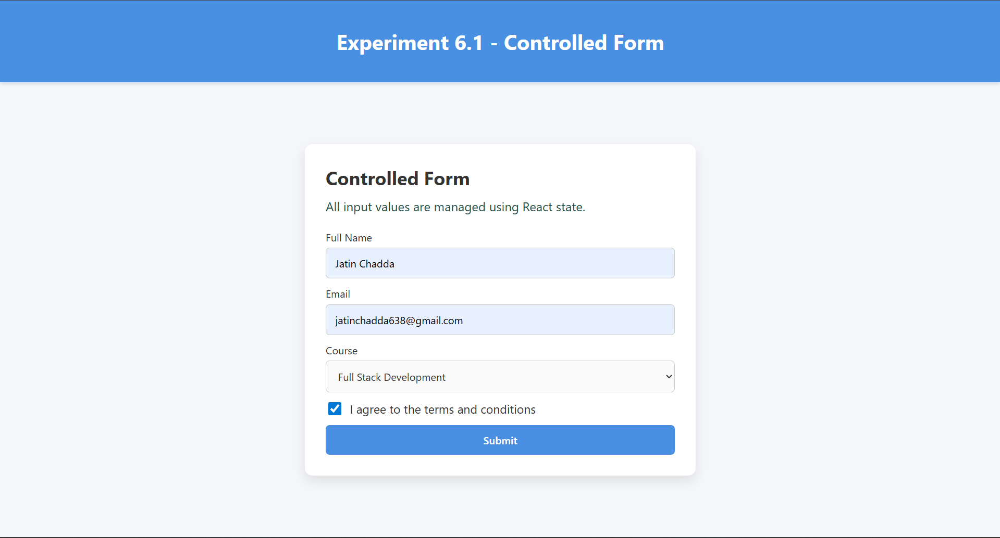
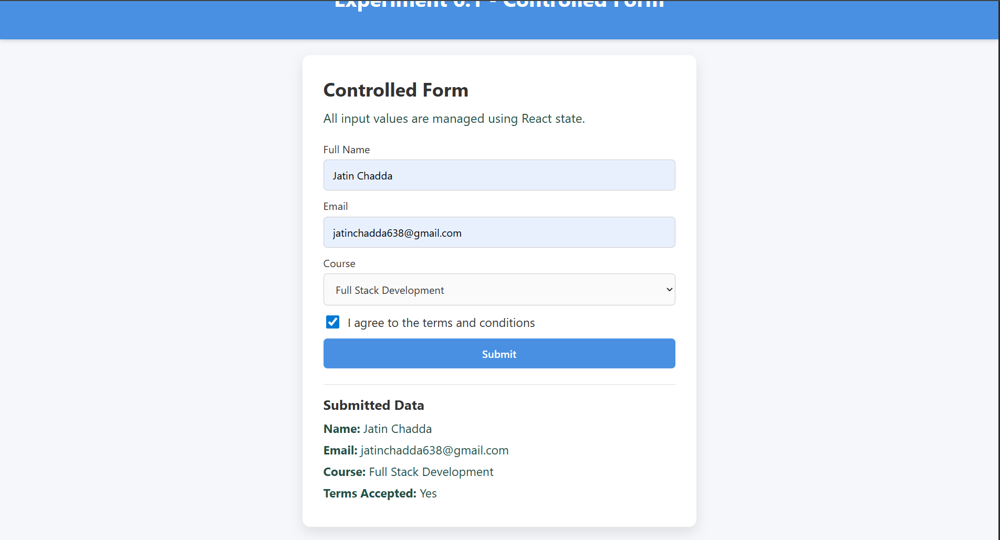

# Experiment–1: Handling Forms Using Controlled Components

## Aim

To create and handle forms in a frontend application using controlled components in React.

## Software Requirements

- Node.js
- React
- VS Code
- Web Browser

## Theory

Controlled components are React components in which form data is handled by the component state. This provides complete control over user input.

## Procedure

1. Create a React application.
2. Create a form component.
3. Use `useState` to store input values.
4. Handle input change events.
5. Submit the form using an event handler.

## What This Experiment Includes

- A controlled form with text, email, dropdown, and checkbox fields.
- Unified `handleChange` logic to update state for all form inputs.
- `handleSubmit` to prevent default reload and show submitted values.

## Screenshots

### Screenshot 1



### Screenshot 2



## Run

```bash
cd Experiment_6/6.1
npm install
npm run dev
```

## Build

```bash
npm run build
```
