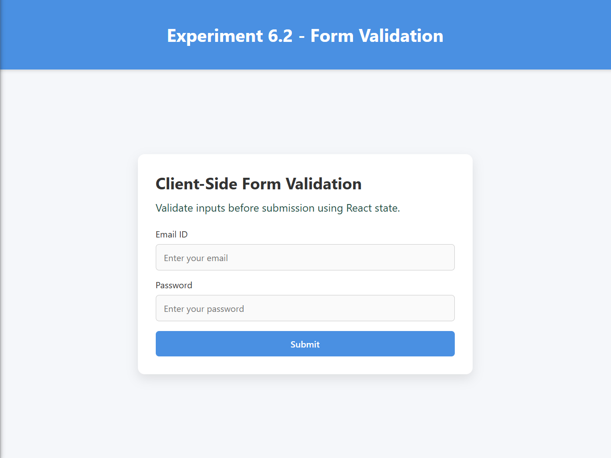
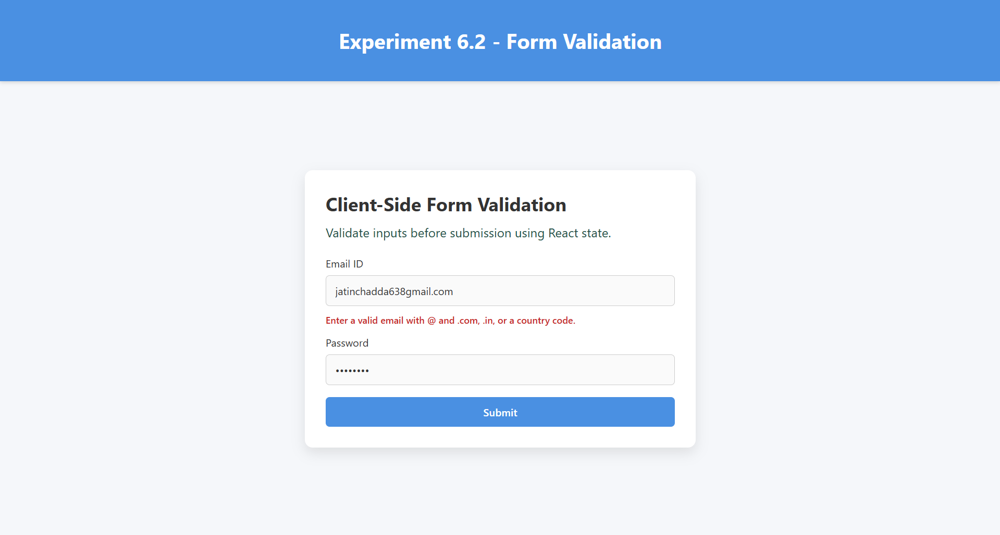
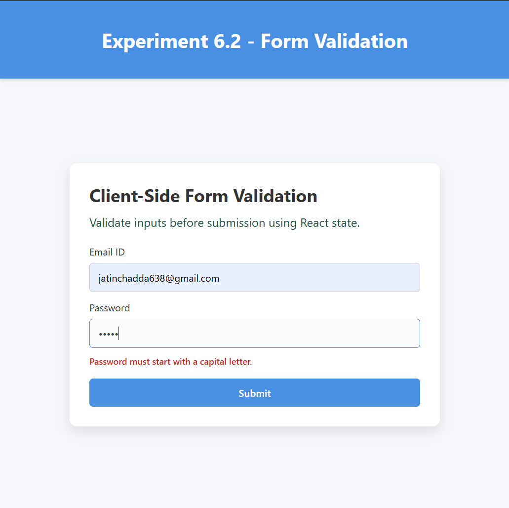
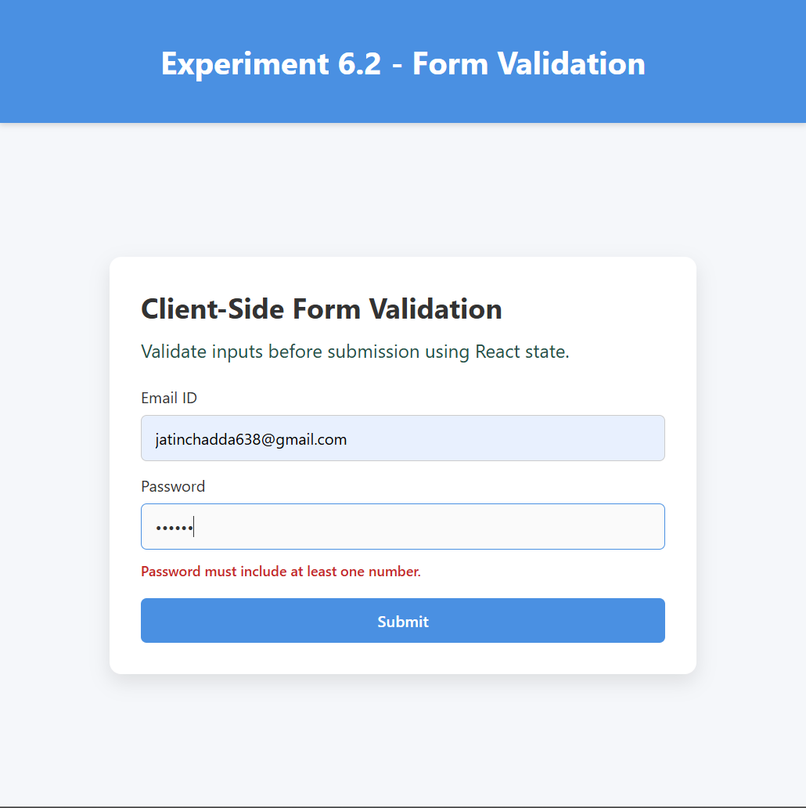
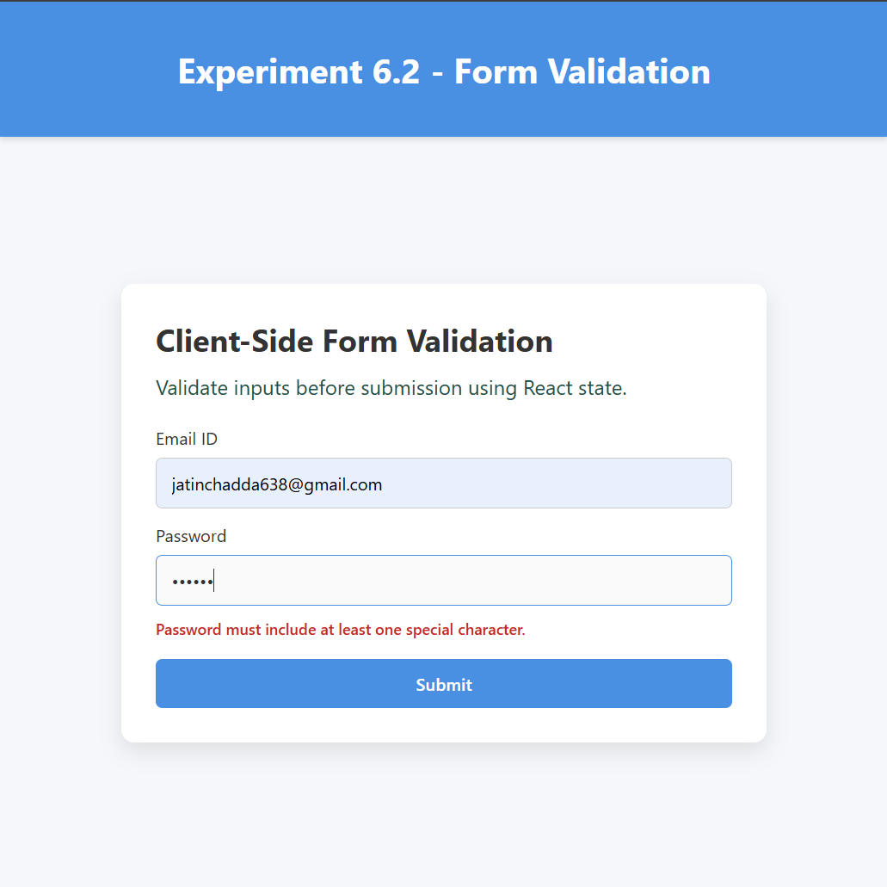
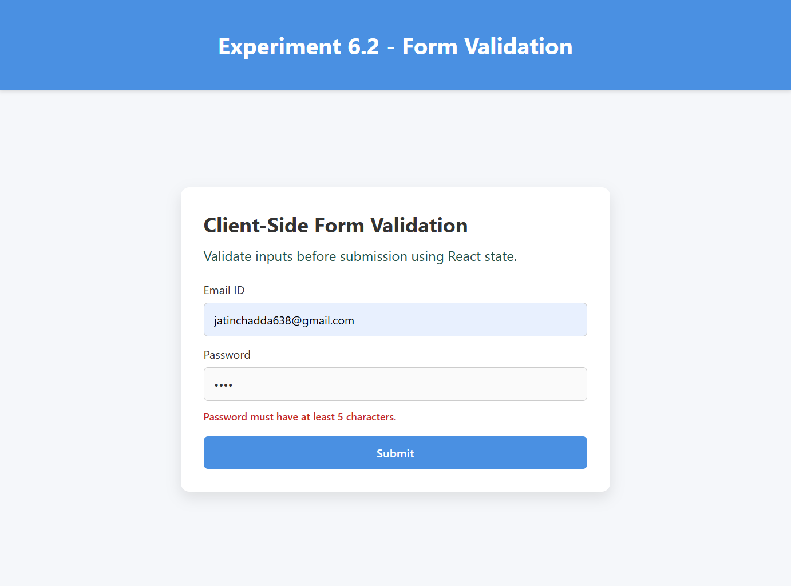
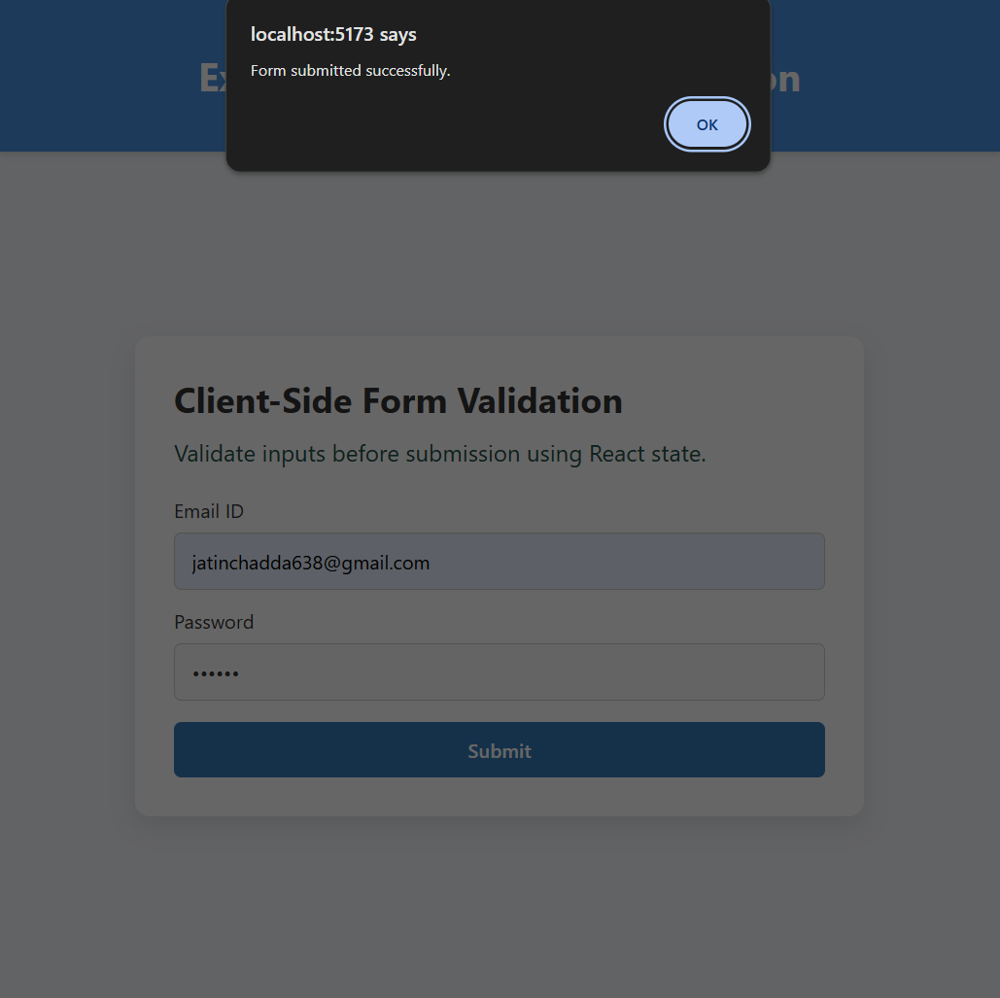

# Experiment–2: Client-Side Form Validation

## Aim

To validate form inputs on the client side before submission.

## Theory

Client-side validation ensures correctness of user data and provides immediate feedback without server interaction.

## Procedure

1. Create form inputs.
2. Define validation conditions.
3. Display error messages.
4. Allow submission only for valid data.

## Validation Rules Used

### Email ID

- Must include `@`
- Must end with `.com`, `.in`, or a valid country code extension

### Password

1. Should start with a capital letter
2. Should have at least one number
3. Should have at least one special character
4. Should have at least 5 characters

## Screenshots

### 1. Home / Initial Form

![Home - Initial Form]

### 2. Email Validation



### 3. Password Validation - Must Start with Capital Letter



### 4. Password Validation - Must Have at Least One Number



### 5. Password Validation - Must Have at Least One Special Character


### 6. Password Validation - Must Have at Least 5 Characters



### 7. Successful Submission


## Run

```bash
cd Experiment_6/6.2
npm install
npm run dev
```

## Build

```bash
npm run build
```
