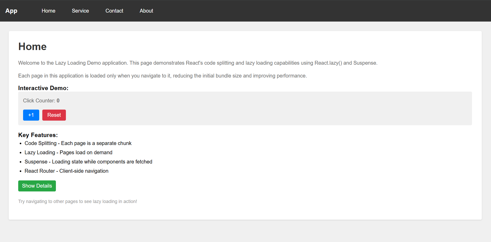
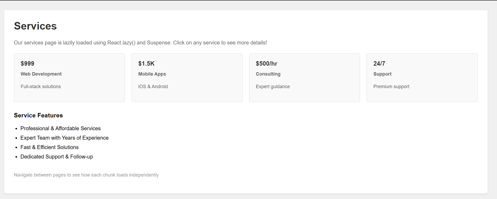
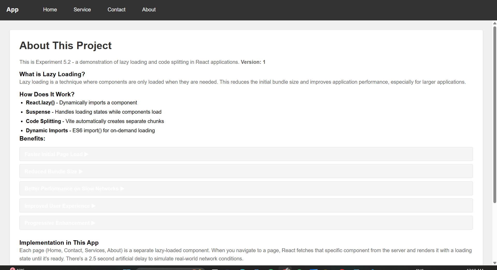

# Experiment 5.2 - React Lazy Loading and Code Splitting

## About

This experiment demonstrates lazy loading and code splitting in React applications with interactive components. Each page is loaded only when needed, reducing the initial bundle size and improving overall application performance. The application includes a 2.5-second artificial delay to simulate real-world network conditions and show the Suspense loading state.

## Key Features

- **Code Splitting**: Each page is a separate JavaScript chunk
- **Lazy Loading**: Pages load on-demand using React.lazy()
- **Suspense**: Loading UI while components are being fetched
- **React Router**: Client-side navigation between pages
- **Optimized Performance**: Reduced initial bundle size

## Project Structure

```
5.2/
├── src/
│   ├── pages/
│   │   ├── Home.jsx          # Home with click counter & expand/collapse demo
│   │   ├── Contact.jsx       # Contact form with validation & feedback
│   │   ├── Services.jsx      # Services with click-to-expand & rating demo
│   │   └── About.jsx         # About with collapsible benefits & version counter
│   ├── App.jsx               # Main app with routing & lazy loading (2.5s delay)
│   ├── App.css               # Styles
│   ├── main.jsx              # Entry point
│   └── index.css             # Global styles
├── index.html                # HTML template
├── package.json              # Dependencies
└── vite.config.js            # Vite configuration
```

## How to Run

1. Install dependencies:
   ```bash
   npm install
   ```

2. Start development server:
   ```bash
   npm run dev
   ```

3. Open your browser and navigate through the pages to see lazy loading in action

## Pages Included

### 1. **Home Page**
   - Introduction to lazy loading
   - **Interactive Demo:** Click counter with +1 button and reset
   - Collapsible "Show Details" section
   - Key features overview
   - Navigation guide

### 2. **Contact Page**
   - Functional contact form with validation
   - Form fields: Name, Email, Message
   - Success message on submission
   - Auto-clear form after 2 seconds
   - Lazy loaded on demand

### 3. **Services Page**
   - Service cards with pricing
   - **Interactive Elements:**
     - Click card to expand and view details
     - 👍 Rate button with counter (tracks rating votes)
   - Service options: Web Development, Mobile Apps, Consulting, Support
   - Code split into separate chunk

### 4. **About Page**
   - Explanation of lazy loading & code splitting
   - **Interactive Benefits List:** Click to expand each benefit with detailed explanation
   - Version counter that increments
   - DevTools debugging tips
   - Implementation details for this demo

## Technologies Used

- **React 18** - UI framework
- **React Router v6** - Client-side routing
- **Vite** - Build tool with built-in code splitting
- **React.lazy()** - Dynamic component loading
- **Suspense** - Loading boundary for lazy components


## Performance Benefits

✅ **Faster Initial Load** - Only loads Home page initially  
✅ **Reduced Bundle Size** - Other pages loaded when navigated  
✅ **Better UX** - No blocking on slow networks  
✅ **Scalable** - Easy to add more lazy-loaded pages  
✅ **Progressive Enhancement** - Works with fallback UI  

## Concepts Covered

✅ React.lazy() - Dynamic imports  
✅ Suspense - Loading boundaries  
✅ Code Splitting - Chunk creation  
✅ React Router - Client-side routing  
✅ Route-based Code Splitting  
✅ Loading States  
✅ Dynamic Module Loading  

## How Lazy Loading Works

1. When app loads, only Home page code is bundled
2. Each page (Contact, Services, About) gets a separate chunk
3. When you navigate to a page, React requests that chunk
4. A 2.5-second artificial delay simulates network conditions
5. Suspense shows loading spinner while chunk downloads
6. Component loads and renders with interactive features
7. Browser shows the loaded page

## Try It Out





