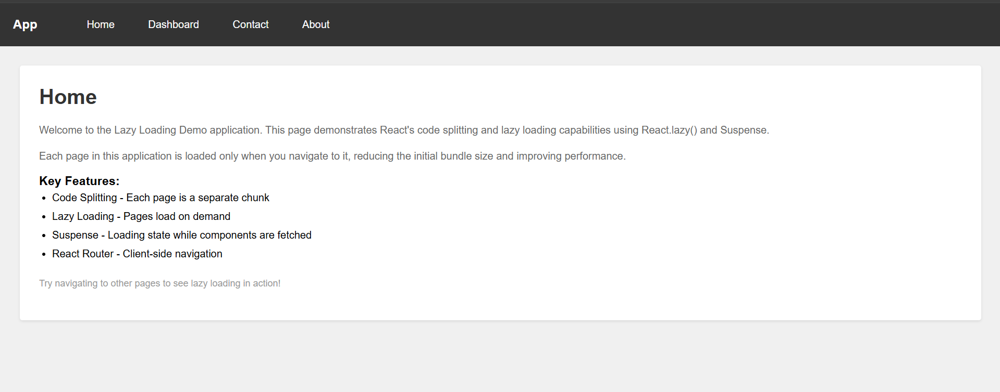
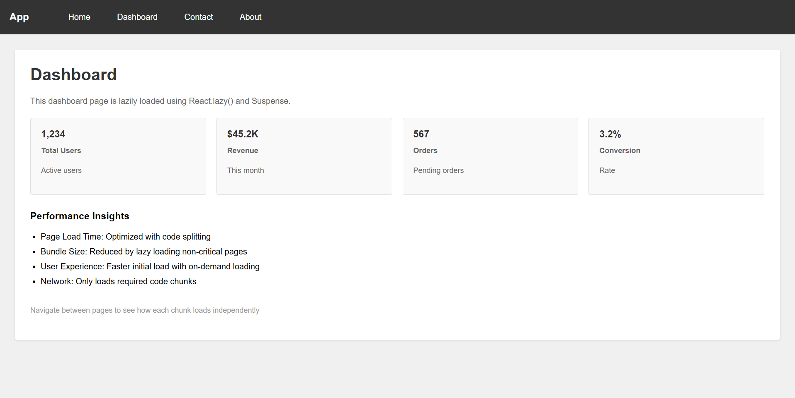
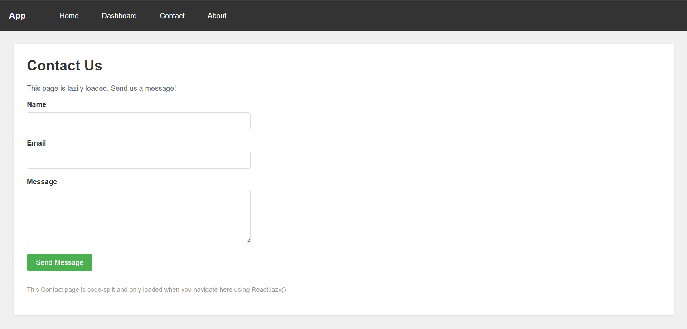
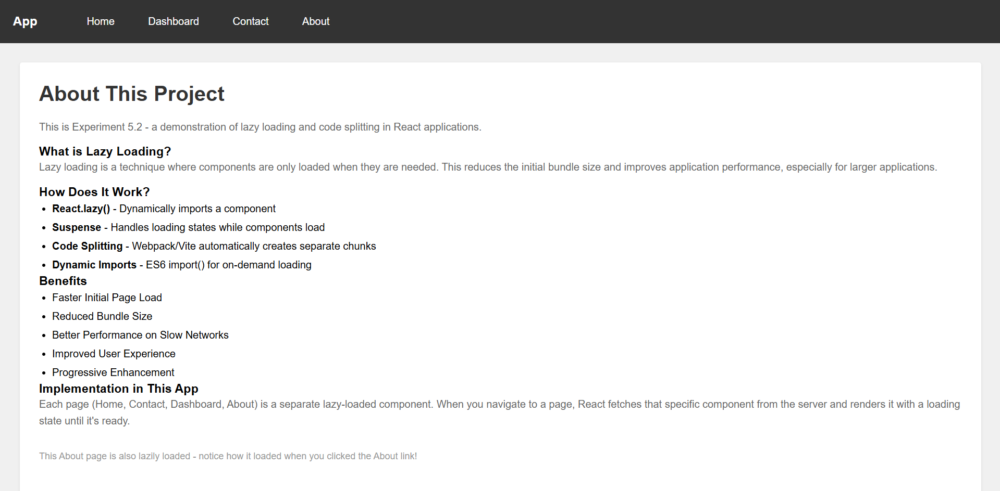

# Experiment 5.2 - React Lazy Loading and Code Splitting

## About

This experiment demonstrates lazy loading and code splitting in React applications. Each page is loaded only when needed, reducing the initial bundle size and improving overall application performance.

## Key Features

- **Code Splitting**: Each page is a separate JavaScript chunk
- **Lazy Loading**: Pages load on-demand using React.lazy()
- **Suspense**: Loading UI while components are being fetched
- **React Router**: Client-side navigation between pages
- **Optimized Performance**: Reduced initial bundle size

## Project Structure

```
5.2/
├── src/
│   ├── pages/
│   │   ├── Home.jsx          # Home page (lazy loaded)
│   │   ├── Contact.jsx       # Contact form (lazy loaded)
│   │   ├── Dashboard.jsx     # Dashboard page (lazy loaded)
│   │   └── About.jsx         # About page (lazy loaded)
│   ├── App.jsx               # Main app with routing & lazy loading
│   ├── App.css               # Styles
│   ├── main.jsx              # Entry point
│   └── index.css             # Global styles
├── index.html                # HTML template
├── package.json              # Dependencies
└── vite.config.js            # Vite configuration
```

## How to Run

1. Install dependencies:
   ```bash
   npm install
   ```

2. Start development server:
   ```bash
   npm run dev
   ```

3. Open your browser and navigate through the pages to see lazy loading in action

## Pages Included

### 1. **Home Page**
   - Introduction to lazy loading
   - Key features overview
   - Navigation guide

### 2. **Contact Page**
   - Functional contact form
   - Form validation
   - Success message on submission
   - Lazy loaded on demand

### 3. **Dashboard Page**
   - Statistics cards
   - Performance insights
   - Data visualization
   - Code split into separate chunk

### 4. **About Page**
   - Explanation of lazy loading
   - How it works
   - Benefits and advantages
   - Implementation details

## Technologies Used

- **React 18** - UI framework
- **React Router v6** - Client-side routing
- **Vite** - Build tool with built-in code splitting
- **React.lazy()** - Dynamic component loading
- **Suspense** - Loading boundary for lazy components


## Performance Benefits

✅ **Faster Initial Load** - Only loads Home page initially  
✅ **Reduced Bundle Size** - Other pages loaded when navigated  
✅ **Better UX** - No blocking on slow networks  
✅ **Scalable** - Easy to add more lazy-loaded pages  
✅ **Progressive Enhancement** - Works with fallback UI  

## Concepts Covered

✅ React.lazy() - Dynamic imports  
✅ Suspense - Loading boundaries  
✅ Code Splitting - Chunk creation  
✅ React Router - Client-side routing  
✅ Route-based Code Splitting  
✅ Loading States  
✅ Dynamic Module Loading  

## How Lazy Loading Works

1. When app loads, only Home page code is bundled
2. Each page (Contact, Dashboard, About) gets a separate chunk
3. When you navigate to a page, React requests that chunk
4. Suspense shows loading state while chunk downloads
5. Parser loads and renders the component
6. Browser shows the loaded page

## Try It Out

Navigate between pages and observe:
- Loading spinner appears briefly
- Pages load only when needed
- URL updates without full page reload
- Each page chunk is fetched separately
- Smooth user experience with fallback UI

## Browser DevTools Inspection

In Chrome DevTools Network tab, you can:
1. Go to Network tab
2. Navigate between pages
3. See each page's chunk being fetched
4. Observe file sizes (chunks are smaller individually)
5. Check waterfall for optimized loading sequence





